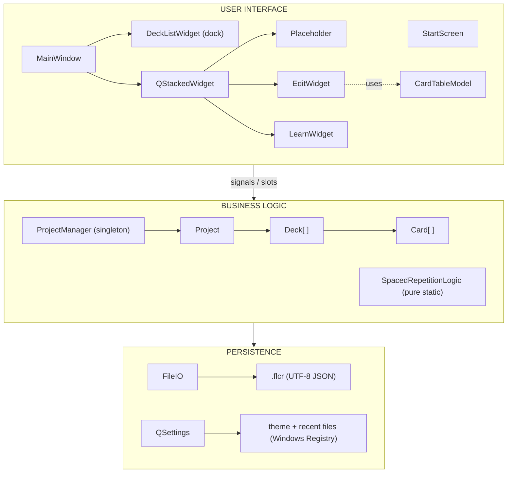
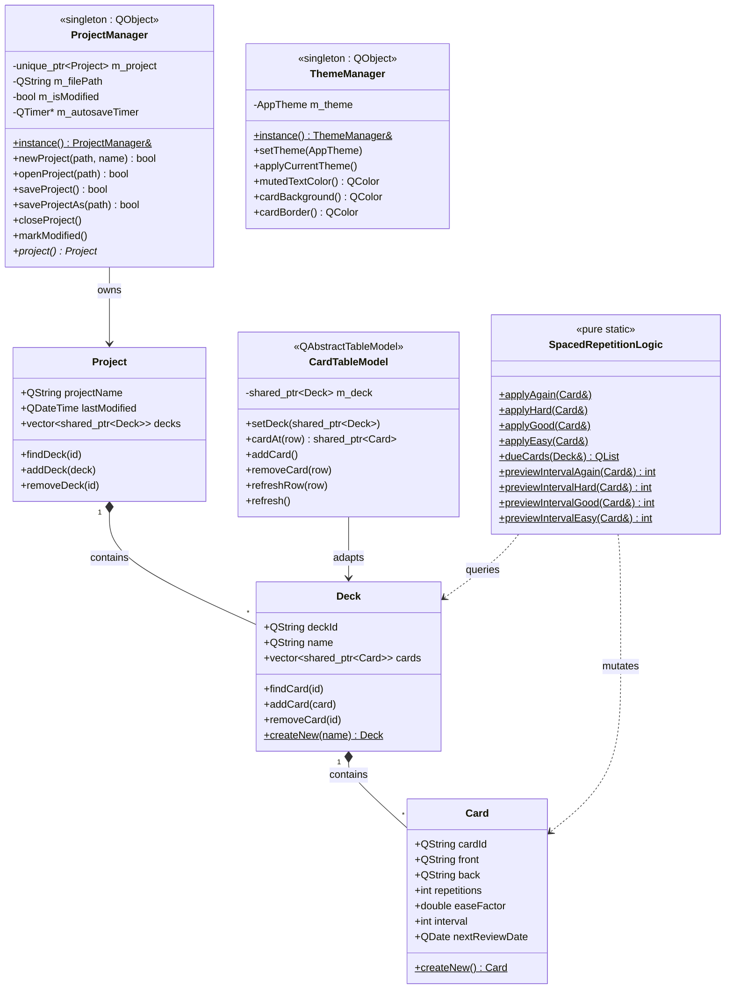
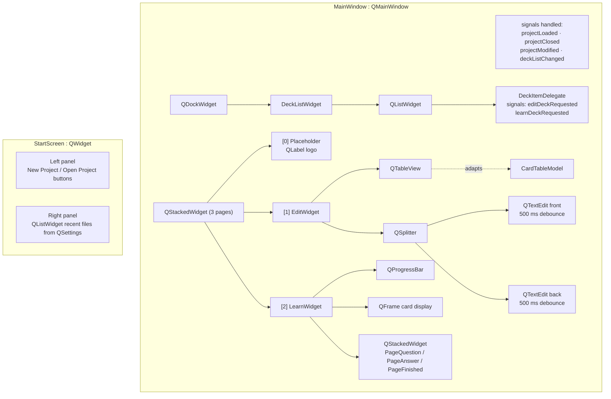
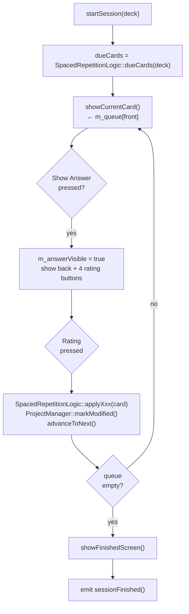

# FlashCard Studio — Developer Documentation

## Table of Contents

1. [Project Overview](#1-project-overview)
2. [Tech Stack & Dependencies](#2-tech-stack--dependencies)
3. [Repository Structure](#3-repository-structure)
4. [Architecture: MVC Pattern](#4-architecture-mvc-pattern)
5. [Class Diagram (OOP)](#5-class-diagram-oop)
6. [Data Layer — Models](#6-data-layer--models)
7. [View Layer — Widgets](#7-view-layer--widgets)
8. [Utility Layer](#8-utility-layer)
9. [Application Entry Point](#9-application-entry-point)
10. [SM-2 Spaced Repetition Algorithm](#10-sm-2-spaced-repetition-algorithm)
11. [File Format: `.flcr`](#11-file-format-flcr)
12. [Signal & Slot Wiring](#12-signal--slot-wiring)
13. [Theme System](#13-theme-system)
14. [Build & Packaging](#14-build--packaging)
15. [Coding Conventions](#15-coding-conventions)

---

## 1. Project Overview

**FlashCard Studio** is a desktop application for creating and studying flashcard decks using the SM-2 spaced repetition algorithm. It is written in C++17 with Qt 6 (Widgets only — no JavaScript, no QML).

- **Project file extension:** `.flcr` (UTF-8 JSON)
- **Platforms:** Windows (primary), macOS, Linux
- **Version:** 1.0.0

---

## 2. Tech Stack & Dependencies

| Component | Version |
|-----------|---------|
| C++ Standard | C++17 |
| Qt | 6.x (Core, Gui, Widgets) |
| Build system | CMake 3.21+ |
| Compiler (Windows) | MinGW 13.x (`mingw1310_64`) |
| Packaging | CPack + NSIS (Windows installer) |
| Persistence | QSettings (theme/recent files), `.flcr` JSON |

No third-party libraries beyond Qt are used.

---

## 3. Repository Structure

```
flashcards-studio/
├── CMakeLists.txt          — Build definition + CPack config
├── resources.qrc           — Qt resource file (icons)
├── icons/                  — SVG/ICO icon assets
│   ├── app_icon.svg / .ico
│   ├── add.svg, delete.svg, edit.svg, play_arrow.svg, ...
│   └── (Material Design icons)
├── windows/
│   └── app_icon.rc         — Windows resource script (embeds .ico)
├── src/
│   ├── main.cpp            — Application entry point
│   ├── models/             — Data layer (pure C++, no UI)
│   │   ├── Card.h / .cpp               — Single flashcard entity
│   │   ├── Deck.h / .cpp               — Ordered collection of cards
│   │   ├── Project.h / .cpp            — Root data object (collection of decks)
│   │   ├── ProjectManager.h / .cpp     — Singleton: owns Project, persistence
│   │   ├── CardTableModel.h / .cpp     — Qt MVC adapter for QTableView
│   │   └── SpacedRepetitionLogic.h / .cpp — Pure-static SM-2 implementation
│   ├── utils/              — Cross-cutting utilities
│   │   ├── FileIO.h / .cpp             — JSON serialization of Project ↔ .flcr
│   │   └── ThemeManager.h / .cpp       — Singleton: Fusion palette + theming
│   └── views/              — UI layer (Qt Widgets)
│       ├── MainWindow.h / .cpp         — QMainWindow shell
│       ├── StartScreen.h / .cpp        — Pre-project splash screen
│       ├── DeckListWidget.h / .cpp     — Dock panel with deck list
│       ├── DeckItemDelegate.h / .cpp   — Custom item renderer for deck list
│       ├── EditWidget.h / .cpp         — Card editor (table + rich-text editors)
│       └── LearnWidget.h / .cpp        — Study session (SM-2 UI)
├── DEV_DOCS.md
└── USER_DOCS.md
```

---

## 4. Architecture: MVC Pattern

The application follows Qt's Model-View-Controller pattern, extended with a central **ProjectManager** singleton that acts as the application-wide state container.



---

## 5. Class Diagram (OOP)





---

## 6. Data Layer — Models

### 6.1 `Card`

Plain data class, no Qt parent. Managed exclusively via `std::shared_ptr<Card>`.

| Field | Type | Description |
|-------|------|-------------|
| `cardId` | `QString` | UUID (no braces), generated once at creation |
| `front` | `QString` | HTML rich text (output of `QTextEdit::toHtml()`) |
| `back` | `QString` | HTML rich text |
| `repetitions` | `int` | Successful review streak (SM-2) |
| `easeFactor` | `double` | Default 2.5; increases/decreases by rating |
| `interval` | `int` | Days until next review |
| `nextReviewDate` | `QDate` | Absolute date when card next becomes due |

Factory: `Card::createNew()` — assigns a fresh UUID and sets SM-2 defaults.

### 6.2 `Deck`

Ordered list of cards. Also managed via `std::shared_ptr<Deck>`.

| Field | Type | Description |
|-------|------|-------------|
| `deckId` | `QString` | UUID |
| `name` | `QString` | Display name |
| `cards` | `vector<shared_ptr<Card>>` | Ordered collection |

Key methods: `findCard(id)`, `addCard(card)`, `removeCard(id)`.  
Factory: `Deck::createNew(name)`.

### 6.3 `Project`

Root object. Loaded into memory by `ProjectManager`.

| Field | Type | Description |
|-------|------|-------------|
| `projectName` | `QString` | Displayed in title bar |
| `lastModified` | `QDateTime` | Written on save |
| `decks` | `vector<shared_ptr<Deck>>` | Flat list of decks |

### 6.4 `ProjectManager` (Singleton)

Owns the single in-memory `Project`. All write operations must go through `ProjectManager` so `m_isModified` is set.

**Autosave:** A `QTimer` fires every **3 minutes**. If `m_isModified == true`, `saveProject()` is called automatically.

**Signals emitted:**

| Signal | When |
|--------|------|
| `projectLoaded(filePath)` | After successful open/new |
| `projectClosed()` | After `closeProject()` |
| `projectModified()` | After `markModified()` |
| `deckListChanged()` | After deck added/removed |
| `cardListChanged(deckId)` | After card added/removed in a deck |

### 6.5 `CardTableModel`

Qt MVC adapter. Bridges a `Deck`'s card vector with a `QTableView`.

- **Columns:** `ColId` (hidden), `ColFront` (plain-text preview), `ColBack` (plain-text preview)
- HTML stripping (`stripHtml()`) produces the preview text shown in the table
- Mutations: `addCard()` / `removeCard(row)` — callers must additionally call `ProjectManager::markModified()`
- `refreshRow(row)` — triggers a minimal `dataChanged` after an in-place card edit
- `refresh()` — rebuilds the whole view (e.g. deck switch)

---

## 7. View Layer — Widgets

### 7.1 `StartScreen`

Shown at startup (before any project is open) and after a project is closed.

- **Left panel** (accent color): logo + *New Project* / *Open Project* buttons
- **Right panel** (light): recent files list loaded from `QSettings` key `"recentFiles"`
- `refreshRecentFiles()` — reloads from `QSettings`; called by `main()` whenever the user returns to the start screen

**Signals:** `newProjectRequested()`, `openProjectRequested()`, `openRecentRequested(filePath)`

### 7.2 `MainWindow`

`QMainWindow` that becomes visible after a project loads.

**Menu structure:**

- **File:** New (`Ctrl+N`), Open (`Ctrl+O`), Save (`Ctrl+S`), Save As, Close (→ start screen), Quit
- **Edit:** Undo (`Ctrl+Z`), Redo (`Ctrl+Y`)
- **View:** Light Theme / Dark Theme
- **Help:** About

**Central area** — `QStackedWidget` with three pages:

| Index | Constant | Content |
|-------|----------|---------|
| 0 | `PagePlaceholder` | Logo label (shown when no deck is selected) |
| 1 | `PageEdit` | `EditWidget` |
| 2 | `PageLearn` | `LearnWidget` |

`showEditDeck(deckId)` and `showLearnDeck(deckId)` switch pages and initialize the respective widget.

### 7.3 `DeckListWidget`

Content widget inside a `QDockWidget`. Shows a `QListWidget` of all decks.

- **Search bar** (`QLineEdit`): filters list items in real-time via `filterItems()`
- **Add button** (`QToolButton`): creates a new `Deck` through `ProjectManager`
- **Custom delegate** (`DeckItemDelegate`): renders each deck row with hover buttons: ✏️ (edit) and ▶️ (learn)
- `refresh()` — rebuilds the list from `ProjectManager::project()->decks`

**Signals:** `editDeckRequested(deckId)`, `learnDeckRequested(deckId)`

### 7.4 `DeckItemDelegate`

Custom `QStyledItemDelegate`. Paints the deck row and detects hover state to reveal the edit/learn icon buttons. Handles mouse events via `MainWindow::DeckListWidget::eventFilter`.

### 7.5 `EditWidget`

Split editor for a single deck.

**Top half:** `QTableView` + toolbar with add/delete card buttons and a stats label.

**Bottom half** (separated by `QSplitter`):
- Two `QTextEdit` widgets (front and back) with a shared formatting toolbar (Bold/Italic/Underline via `QAction`)
- **Debounce timers**: `m_frontDebounce` / `m_backDebounce` — each fires 500 ms after the last keystroke; on timeout, `commitFrontToModel()` / `commitBackToModel()` write the HTML back to `Card` and call `ProjectManager::markModified()` + `CardTableModel::refreshRow()`

`setDeck(deck)` — switches to a different deck, resets selection and clears the editor.

### 7.6 `LearnWidget`

Spaced-repetition study session UI.

**Session flow:**



**Control panels** (nested `QStackedWidget`):

| Index | State |
|-------|-------|
| `PageQuestion` (0) | "Show Answer" button only |
| `PageAnswer` (1) | 4 rating buttons (Again / Hard / Good / Easy) + interval previews |
| `PageFinished` (2) | Celebration icon + "All done for today!" message |

---

## 8. Utility Layer

### 8.1 `FileIO`

Pure static class. All serialization/deserialization of `.flcr` files lives here.

**Save:** `Project` → `QJsonDocument` (indented) → UTF-8 file.

**Load:** UTF-8 file → `QJsonDocument` → `unique_ptr<Project>`.

**JSON keys (constants):**

```cpp
kProjectName, kLastModified, kDecks,
kDeckID, kDeckName, kCards,
kCardID, kFront, kBack,
kRepetitions, kEaseFactor, kInterval, kNextReview
```

Dates use `Qt::ISODate` format (`YYYY-MM-DD` for `QDate`, `YYYY-MM-DDTHH:MM:SS` for `QDateTime`).

### 8.2 `ThemeManager`

Singleton that applies Qt **Fusion** style + a custom `QPalette`. The theme is persisted in `QSettings` and restored on next launch.

**Themes:** `AppTheme::Light`, `AppTheme::Dark`

Per-theme color helpers (used by widgets with inline stylesheets):

- `mutedTextColor()` — secondary text
- `cardBackground()` — LearnWidget card frame background
- `cardBorder()` — LearnWidget card frame border
- `showAnswerHoverBackground()` — hover color for "Show Answer"
- `hoverButtonColor()` — generic hover

**Signal:** `themeChanged(AppTheme)` — connected to `StartScreen::applyCurrentTheme()` and `MainWindow::applyCurrentTheme()` / `LearnWidget::applyCurrentTheme()`.

---

## 9. Application Entry Point

`main()` in `src/main.cpp`:

1. Creates `QApplication` with app name, org name, version.
2. Calls `ThemeManager::instance().applyCurrentTheme()` — sets Fusion palette before any window is constructed.
3. Instantiates `StartScreen` and `MainWindow` (both live for the app's lifetime).
4. Checks `argv[1]` — if a `.flcr` path is given, opens it directly and skips the start screen.
5. Wires up lambdas:
   - `StartScreen` signals → `MainWindow` slots → show main window
   - `ProjectManager::projectClosed` → hide main window, refresh and show start screen
6. Shows `StartScreen` and starts the event loop.

---

## 10. SM-2 Spaced Repetition Algorithm

Implemented in `SpacedRepetitionLogic` as a set of pure static methods. All methods mutate the card **in place**.

### Card initial state

```
repetitions   = 0
interval      = 1
easeFactor    = 2.5
nextReviewDate = today
```

### Rating formulas

| Button | Color | Effect |
|--------|-------|--------|
| **Again** | Red | `repetitions=0`, `interval=1`, `easeFactor=max(1.3, ef-0.20)`, `nextReview=today` (re-queued same day) |
| **Hard** | Orange | `repetitions+=1`, `interval=round(interval * 1.2)`, `nextReview=today+interval` |
| **Good** | Blue | `repetitions+=1`, `interval=round(interval * easeFactor)`, `nextReview=today+interval` |
| **Easy** | Green | `repetitions+=1`, `easeFactor+=0.15`, `interval=round(interval * easeFactor * 1.3)`, `nextReview=today+interval` |

### Due-card selection

`dueCards(deck)` returns all cards where `nextReviewDate <= QDate::currentDate()`.

### Preview helpers

`previewIntervalXxx(card)` computes the resulting interval without mutating the card. Used by `LearnWidget` to display the "n days" hint under each button.

---

## 11. File Format: `.flcr`

UTF-8 JSON, pretty-printed (indented). The extension is registered in Windows Registry via the NSIS installer (associated with `FlashCardStudio.exe`).

### Schema

```json
{
  "ProjectName": "My Vocabulary",
  "LastModified": "2026-05-18T15:30:00",
  "Decks": [
    {
      "DeckID": "550e8400-e29b-41d4-a716-446655440000",
      "Name": "Spanish Words",
      "Cards": [
        {
          "CardID": "6ba7b810-9dad-11d1-80b4-00c04fd430c8",
          "Front": "<p><b>hola</b></p>",
          "Back":  "<p>hello</p>",
          "Repetitions": 3,
          "EaseFactor": 2.65,
          "Interval": 12,
          "NextReviewDate": "2026-05-30"
        }
      ]
    }
  ]
}
```

`Front` and `Back` contain HTML as produced by `QTextEdit::toHtml()`. When displayed, the value is rendered through Qt's rich-text engine (safe subset of HTML4).

---

## 12. Signal & Slot Wiring

All connections use the Qt 5/6 pointer-to-member syntax. `SIGNAL()`/`SLOT()` macros are not used.

### Key connections across layers

```
ProjectManager::projectLoaded  →  MainWindow::onProjectLoaded
ProjectManager::projectClosed  →  MainWindow::onProjectClosed
ProjectManager::projectModified→  MainWindow::onProjectModified
ProjectManager::deckListChanged→  DeckListWidget::refresh
ProjectManager::cardListChanged→  (EditWidget refreshes if same deck)

DeckListWidget::editDeckRequested  →  MainWindow::onEditDeckRequested
DeckListWidget::learnDeckRequested →  MainWindow::onLearnDeckRequested

LearnWidget::sessionFinished   →  MainWindow::onLearnSessionFinished

ThemeManager::themeChanged     →  StartScreen::applyCurrentTheme
ThemeManager::themeChanged     →  MainWindow::applyCurrentTheme (cascades to LearnWidget)

EditWidget (internal):
  m_frontDebounce::timeout  →  EditWidget::commitFrontToModel
  m_backDebounce::timeout   →  EditWidget::commitBackToModel
  QTableView::selectionChanged → EditWidget::onSelectionChanged

ProjectManager (internal):
  m_autosaveTimer::timeout  →  ProjectManager::autosave
```

---

## 13. Theme System

`ThemeManager::applyCurrentTheme()` sets `QApplication::setStyle("Fusion")` and constructs a `QPalette` based on the chosen theme.

Widgets that have inline stylesheets (e.g. `LearnWidget`, `StartScreen`) connect to `ThemeManager::themeChanged` and call `applyCurrentTheme()` on themselves to rebuild their `setStyleSheet` calls using the helper color methods.

The current theme is stored in `QSettings` under key `"theme"` (`"light"` or `"dark"`).

---

## 14. Build & Packaging

### Local build (Windows)

```powershell
$env:Path = "C:\Qt\Tools\mingw1310_64\bin;$env:Path"

cmake -S . -B build-mingw -G "MinGW Makefiles" `
      -DCMAKE_BUILD_TYPE=Release `
      -DCMAKE_PREFIX_PATH="C:/Qt/6.11.0/mingw_64"

cmake --build build-mingw --parallel
cmake --install build-mingw --prefix build-mingw/install
cpack -B build-mingw -G NSIS
```

The NSIS installer is output to `build-mingw/` as `FlashCard Studio-<version>-win64.exe`.

### What the installer includes

- `FlashCardStudio.exe`
- Qt6 runtime DLLs (`Qt6Core`, `Qt6Gui`, `Qt6Widgets`, `Qt6Network`, `Qt6Svg`)
- Qt plugins (`platforms/qwindows.dll`, `styles/`, `imageformats/`, `iconengines/`, ...)
- MinGW runtime DLLs (`libstdc++-6`, `libgcc_s_seh-1`, `libwinpthread-1`)
- Start Menu + Desktop shortcuts
- `.flcr` file association in Windows Registry (HKCU)
- Uninstaller

### CI/CD

GitHub Actions workflow: `.github/workflows/release-installer.yml`
- Triggered on `workflow_dispatch` and `v*` tags
- Runs on `windows-latest`
- Uploads NSIS installer as artifact

---

## 15. Coding Conventions

| Rule | Detail |
|------|--------|
| **C++ standard** | C++17 |
| **Smart pointers** | `std::shared_ptr<Card/Deck>`, `std::unique_ptr<Project>` — no raw owning pointers |
| **Qt signals/slots** | Pointer-to-member syntax only; no `SIGNAL()`/`SLOT()` macros |
| **Singleton pattern** | `static Foo& instance()` via local static (thread-safe since C++11) |
| **No Qt parent for data classes** | `Card`, `Deck`, `Project` have no `QObject` parent to simplify memory ownership |
| **Debounce pattern** | `QTimer` with `setSingleShot(true)` + `start(500)` restarts on each text change |
| **MVC separation** | UI knows `ProjectManager` but never writes directly to `Project`; always calls `markModified()` |
| **Header guards** | `#pragma once` everywhere |
| **Icon resources** | All icons embedded via `resources.qrc`, referenced as `":/icons/name.svg"` |
| **No QML / JavaScript** | All UI is Qt Widgets (C++) |
