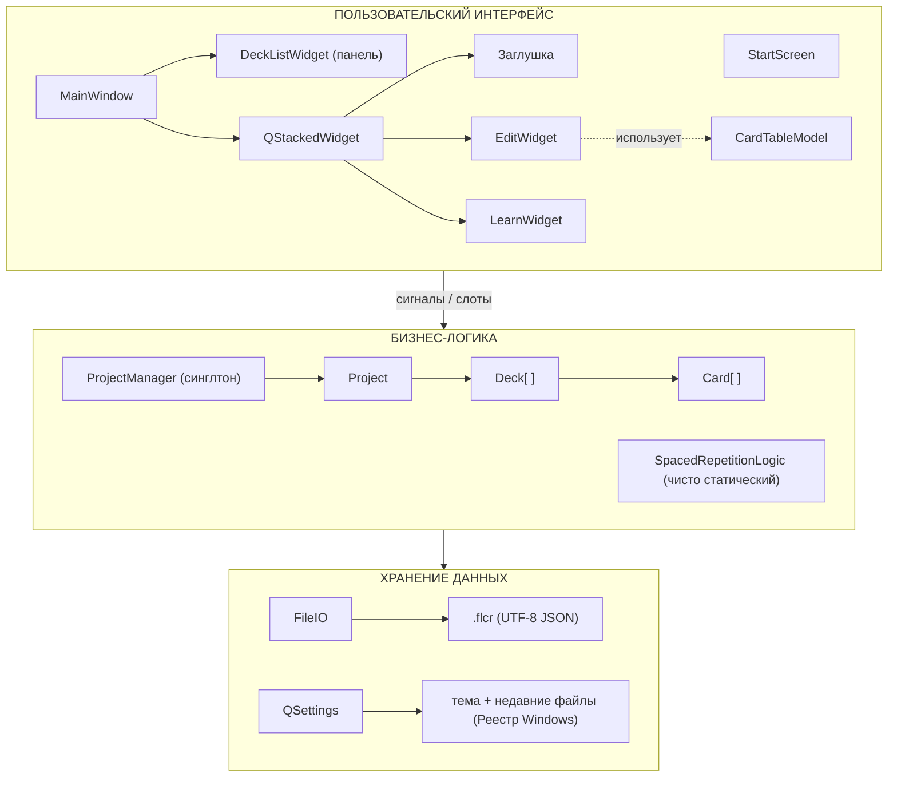
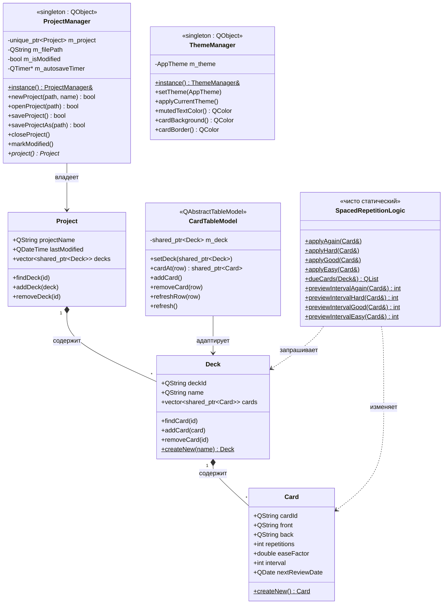
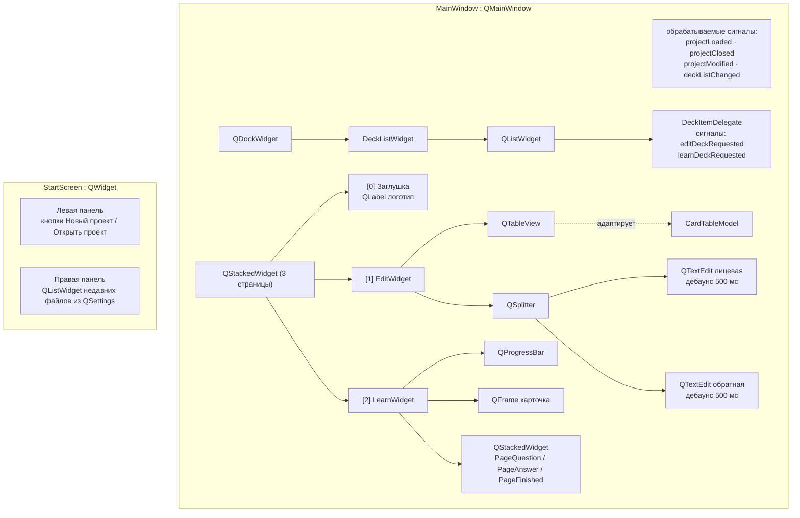
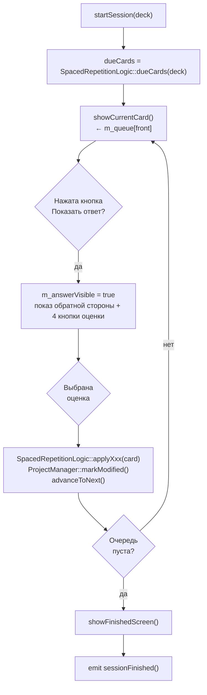

# FlashCard Studio — Документация для разработчиков

## Содержание

1. [Обзор проекта](#1-обзор-проекта)
2. [Технологический стек и зависимости](#2-технологический-стек-и-зависимости)
3. [Структура репозитория](#3-структура-репозитория)
4. [Архитектура: паттерн MVC](#4-архитектура-паттерн-mvc)
5. [Диаграмма классов (ООП)](#5-диаграмма-классов-ооп)
6. [Слой данных — модели](#6-слой-данных--модели)
7. [Слой представления — виджеты](#7-слой-представления--виджеты)
8. [Вспомогательный слой](#8-вспомогательный-слой)
9. [Точка входа в приложение](#9-точка-входа-в-приложение)
10. [Алгоритм интервального повторения SM-2](#10-алгоритм-интервального-повторения-sm-2)
11. [Формат файла `.flcr`](#11-формат-файла-flcr)
12. [Связи сигналов и слотов](#12-связи-сигналов-и-слотов)
13. [Система тем оформления](#13-система-тем-оформления)
14. [Сборка и упаковка](#14-сборка-и-упаковка)
15. [Соглашения о написании кода](#15-соглашения-о-написании-кода)

---

## 1. Обзор проекта

**FlashCard Studio** — настольное приложение для создания и изучения наборов флэшкарт с использованием алгоритма интервального повторения SM-2. Написано на C++17 с Qt 6 (только Widgets — без JavaScript, без QML).

- **Расширение файла проекта:** `.flcr` (UTF-8 JSON)
- **Платформы:** Windows (основная), macOS, Linux
- **Версия:** 1.0.0

---

## 2. Технологический стек и зависимости

| Компонент | Версия |
|-----------|--------|
| Стандарт C++ | C++17 |
| Qt | 6.x (Core, Gui, Widgets) |
| Система сборки | CMake 3.21+ |
| Компилятор (Windows) | MinGW 13.x (`mingw1310_64`) |
| Упаковка | CPack + NSIS (установщик Windows) |
| Хранение настроек | QSettings (тема/недавние файлы), `.flcr` JSON |

Сторонние библиотеки, помимо Qt, не используются.

---

## 3. Структура репозитория

```
flashcards-studio/
├── CMakeLists.txt          — Описание сборки + конфигурация CPack
├── resources.qrc           — Файл ресурсов Qt (иконки)
├── icons/                  — Иконки в форматах SVG/ICO
│   ├── app_icon.svg / .ico
│   ├── add.svg, delete.svg, edit.svg, play_arrow.svg, ...
│   └── (иконки Material Design)
├── windows/
│   └── app_icon.rc         — Скрипт ресурсов Windows (встраивает .ico)
├── src/
│   ├── main.cpp            — Точка входа в приложение
│   ├── models/             — Слой данных (чистый C++, без UI)
│   │   ├── Card.h / .cpp               — Одиночная флэшкарта
│   │   ├── Deck.h / .cpp               — Упорядоченная коллекция карточек
│   │   ├── Project.h / .cpp            — Корневой объект данных (набор колод)
│   │   ├── ProjectManager.h / .cpp     — Синглтон: владеет Project, управляет хранением
│   │   ├── CardTableModel.h / .cpp     — Qt MVC-адаптер для QTableView
│   │   └── SpacedRepetitionLogic.h / .cpp — Реализация SM-2 (чисто статическая)
│   ├── utils/              — Сквозные утилиты
│   │   ├── FileIO.h / .cpp             — JSON-сериализация Project ↔ .flcr
│   │   └── ThemeManager.h / .cpp       — Синглтон: палитра Fusion + темы
│   └── views/              — Слой UI (Qt Widgets)
│       ├── MainWindow.h / .cpp         — Оболочка QMainWindow
│       ├── StartScreen.h / .cpp        — Стартовый экран (до открытия проекта)
│       ├── DeckListWidget.h / .cpp     — Боковая панель со списком колод
│       ├── DeckItemDelegate.h / .cpp   — Пользовательский рендерер строки колоды
│       ├── EditWidget.h / .cpp         — Редактор карточек (таблица + редакторы rich-text)
│       └── LearnWidget.h / .cpp        — Учебная сессия (UI SM-2)
├── DEV_DOCS.md
└── USER_DOCS.md
```

---

## 4. Архитектура: паттерн MVC

Приложение следует паттерну Model-View-Controller из Qt, расширенному центральным синглтоном **ProjectManager**, который выступает хранилищем состояния всего приложения.



---

## 5. Диаграмма классов (ООП)





---

## 6. Слой данных — модели

### 6.1 `Card`

Простой класс данных, без Qt-родителя. Управляется исключительно через `std::shared_ptr<Card>`.

| Поле | Тип | Описание |
|------|-----|----------|
| `cardId` | `QString` | UUID (без фигурных скобок), генерируется однократно при создании |
| `front` | `QString` | HTML rich-text (результат `QTextEdit::toHtml()`) |
| `back` | `QString` | HTML rich-text |
| `repetitions` | `int` | Серия успешных повторений (SM-2) |
| `easeFactor` | `double` | По умолчанию 2.5; увеличивается/уменьшается в зависимости от оценки |
| `interval` | `int` | Дней до следующего повторения |
| `nextReviewDate` | `QDate` | Абсолютная дата следующего показа карточки |

Фабрика: `Card::createNew()` — присваивает новый UUID и устанавливает значения SM-2 по умолчанию.

### 6.2 `Deck`

Упорядоченный список карточек. Также управляется через `std::shared_ptr<Deck>`.

| Поле | Тип | Описание |
|------|-----|----------|
| `deckId` | `QString` | UUID |
| `name` | `QString` | Отображаемое имя |
| `cards` | `vector<shared_ptr<Card>>` | Упорядоченная коллекция |

Ключевые методы: `findCard(id)`, `addCard(card)`, `removeCard(id)`.  
Фабрика: `Deck::createNew(name)`.

### 6.3 `Project`

Корневой объект. Загружается в память через `ProjectManager`.

| Поле | Тип | Описание |
|------|-----|----------|
| `projectName` | `QString` | Отображается в заголовке окна |
| `lastModified` | `QDateTime` | Записывается при сохранении |
| `decks` | `vector<shared_ptr<Deck>>` | Плоский список колод |

### 6.4 `ProjectManager` (Синглтон)

Владеет единственным объектом `Project` в памяти. Все операции записи должны проходить через `ProjectManager`, чтобы флаг `m_isModified` устанавливался корректно.

**Автосохранение:** `QTimer` срабатывает каждые **3 минуты**. Если `m_isModified == true`, автоматически вызывается `saveProject()`.

**Испускаемые сигналы:**

| Сигнал | Когда |
|--------|-------|
| `projectLoaded(filePath)` | После успешного открытия/создания |
| `projectClosed()` | После `closeProject()` |
| `projectModified()` | После `markModified()` |
| `deckListChanged()` | После добавления/удаления колоды |
| `cardListChanged(deckId)` | После добавления/удаления карточки в колоде |

### 6.5 `CardTableModel`

Qt MVC-адаптер. Связывает вектор карточек `Deck` с `QTableView`.

- **Столбцы:** `ColId` (скрытый), `ColFront` (предпросмотр plain-text), `ColBack` (предпросмотр plain-text)
- Очистка HTML (`stripHtml()`) формирует текст предпросмотра в таблице
- Мутации: `addCard()` / `removeCard(row)` — вызывающий код должен дополнительно вызвать `ProjectManager::markModified()`
- `refreshRow(row)` — инициирует минимальный `dataChanged` после редактирования карточки на месте
- `refresh()` — полностью перестраивает представление (например, при смене колоды)

---

## 7. Слой представления — виджеты

### 7.1 `StartScreen`

Отображается при запуске (до открытия проекта) и после закрытия проекта.

- **Левая панель** (акцентный цвет): логотип + кнопки *Новый проект* / *Открыть проект*
- **Правая панель** (светлая): список недавних файлов, загружаемый из ключа `"recentFiles"` в `QSettings`
- `refreshRecentFiles()` — перезагружает данные из `QSettings`; вызывается `main()` при каждом возврате пользователя на стартовый экран

**Сигналы:** `newProjectRequested()`, `openProjectRequested()`, `openRecentRequested(filePath)`

### 7.2 `MainWindow`

`QMainWindow`, становящееся видимым после загрузки проекта.

**Структура меню:**

- **Файл:** Создать (`Ctrl+N`), Открыть (`Ctrl+O`), Сохранить (`Ctrl+S`), Сохранить как, Закрыть (→ стартовый экран), Выход
- **Правка:** Отменить (`Ctrl+Z`), Повторить (`Ctrl+Y`)
- **Вид:** Светлая тема / Тёмная тема
- **Справка:** О программе

**Центральная область** — `QStackedWidget` с тремя страницами:

| Индекс | Константа | Содержимое |
|--------|-----------|------------|
| 0 | `PagePlaceholder` | Метка с логотипом (отображается, когда колода не выбрана) |
| 1 | `PageEdit` | `EditWidget` |
| 2 | `PageLearn` | `LearnWidget` |

`showEditDeck(deckId)` и `showLearnDeck(deckId)` переключают страницы и инициализируют соответствующий виджет.

### 7.3 `DeckListWidget`

Содержимое `QDockWidget`. Показывает `QListWidget` со всеми колодами.

- **Строка поиска** (`QLineEdit`): фильтрует элементы списка в реальном времени через `filterItems()`
- **Кнопка добавления** (`QToolButton`): создаёт новую `Deck` через `ProjectManager`
- **Пользовательский делегат** (`DeckItemDelegate`): отрисовывает строку каждой колоды с кнопками при наведении: ✏️ (редактировать) и ▶️ (учить)
- `refresh()` — перестраивает список из `ProjectManager::project()->decks`

**Сигналы:** `editDeckRequested(deckId)`, `learnDeckRequested(deckId)`

### 7.4 `DeckItemDelegate`

Пользовательский `QStyledItemDelegate`. Отрисовывает строку колоды и определяет состояние наведения для отображения кнопок-иконок редактирования/обучения. Обрабатывает события мыши через `MainWindow::DeckListWidget::eventFilter`.

### 7.5 `EditWidget`

Разделённый редактор для одной колоды.

**Верхняя половина:** `QTableView` + панель инструментов с кнопками добавления/удаления карточек и меткой статистики.

**Нижняя половина** (разделена `QSplitter`):
- Два виджета `QTextEdit` (лицевая и обратная сторона) с общей панелью форматирования (Жирный/Курсив/Подчёркивание через `QAction`)
- **Таймеры дебаунса**: `m_frontDebounce` / `m_backDebounce` — каждый срабатывает через 500 мс после последнего нажатия клавиши; по срабатыванию `commitFrontToModel()` / `commitBackToModel()` записывают HTML в `Card` и вызывают `ProjectManager::markModified()` + `CardTableModel::refreshRow()`

`setDeck(deck)` — переключается на другую колоду, сбрасывает выделение и очищает редактор.

### 7.6 `LearnWidget`

UI учебной сессии с интервальным повторением.

**Ход сессии:**



**Панели управления** (вложенный `QStackedWidget`):

| Индекс | Состояние |
|--------|-----------|
| `PageQuestion` (0) | Только кнопка «Показать ответ» |
| `PageAnswer` (1) | 4 кнопки оценки (Снова / Трудно / Хорошо / Легко) + предпросмотр интервалов |
| `PageFinished` (2) | Иконка праздника + сообщение «На сегодня всё!» |

---

## 8. Вспомогательный слой

### 8.1 `FileIO`

Чисто статический класс. Вся сериализация/десериализация файлов `.flcr` находится здесь.

**Сохранение:** `Project` → `QJsonDocument` (с отступами) → UTF-8 файл.

**Загрузка:** UTF-8 файл → `QJsonDocument` → `unique_ptr<Project>`.

**JSON-ключи (константы):**

```cpp
kProjectName, kLastModified, kDecks,
kDeckID, kDeckName, kCards,
kCardID, kFront, kBack,
kRepetitions, kEaseFactor, kInterval, kNextReview
```

Даты используют формат `Qt::ISODate` (`YYYY-MM-DD` для `QDate`, `YYYY-MM-DDTHH:MM:SS` для `QDateTime`).

### 8.2 `ThemeManager`

Синглтон, применяющий стиль Qt **Fusion** + пользовательскую `QPalette`. Тема сохраняется в `QSettings` и восстанавливается при следующем запуске.

**Темы:** `AppTheme::Light`, `AppTheme::Dark`

Вспомогательные методы цветов для каждой темы (используются виджетами со встроенными таблицами стилей):

- `mutedTextColor()` — вторичный текст
- `cardBackground()` — фон рамки карточки в LearnWidget
- `cardBorder()` — граница рамки карточки в LearnWidget
- `showAnswerHoverBackground()` — цвет наведения для «Показать ответ»
- `hoverButtonColor()` — универсальный цвет наведения

**Сигнал:** `themeChanged(AppTheme)` — подключён к `StartScreen::applyCurrentTheme()` и `MainWindow::applyCurrentTheme()` / `LearnWidget::applyCurrentTheme()`.

---

## 9. Точка входа в приложение

`main()` в `src/main.cpp`:

1. Создаёт `QApplication` с именем приложения, именем организации, версией.
2. Вызывает `ThemeManager::instance().applyCurrentTheme()` — устанавливает палитру Fusion до создания каких-либо окон.
3. Создаёт `StartScreen` и `MainWindow` (оба живут всё время работы приложения).
4. Проверяет `argv[1]` — если передан путь к `.flcr`, открывает его напрямую, минуя стартовый экран.
5. Подключает лямбды:
   - Сигналы `StartScreen` → слоты `MainWindow` → показ главного окна
   - `ProjectManager::projectClosed` → скрытие главного окна, обновление и показ стартового экрана
6. Показывает `StartScreen` и запускает цикл событий.

---

## 10. Алгоритм интервального повторения SM-2

Реализован в `SpacedRepetitionLogic` в виде набора чисто статических методов. Все методы изменяют карточку **на месте**.

### Начальное состояние карточки

```
repetitions   = 0
interval      = 1
easeFactor    = 2.5
nextReviewDate = сегодня
```

### Формулы для оценок

| Кнопка | Цвет | Эффект |
|--------|------|--------|
| **Снова** | Красный | `repetitions=0`, `interval=1`, `easeFactor=max(1.3, ef-0.20)`, `nextReview=сегодня` (повторяется в тот же день) |
| **Трудно** | Оранжевый | `repetitions+=1`, `interval=round(interval * 1.2)`, `nextReview=сегодня+interval` |
| **Хорошо** | Синий | `repetitions+=1`, `interval=round(interval * easeFactor)`, `nextReview=сегодня+interval` |
| **Легко** | Зелёный | `repetitions+=1`, `easeFactor+=0.15`, `interval=round(interval * easeFactor * 1.3)`, `nextReview=сегодня+interval` |

### Выборка карточек для повторения

`dueCards(deck)` возвращает все карточки, у которых `nextReviewDate <= QDate::currentDate()`.

### Вспомогательные методы предпросмотра

`previewIntervalXxx(card)` вычисляет итоговый интервал без изменения карточки. Используется в `LearnWidget` для отображения подсказки «n дней» под каждой кнопкой.

---

## 11. Формат файла `.flcr`

UTF-8 JSON с форматированием (отступы). Расширение регистрируется в реестре Windows через установщик NSIS (ассоциируется с `FlashCardStudio.exe`).

### Схема

```json
{
  "ProjectName": "Мой словарный запас",
  "LastModified": "2026-05-18T15:30:00",
  "Decks": [
    {
      "DeckID": "550e8400-e29b-41d4-a716-446655440000",
      "Name": "Испанские слова",
      "Cards": [
        {
          "CardID": "6ba7b810-9dad-11d1-80b4-00c04fd430c8",
          "Front": "<p><b>hola</b></p>",
          "Back":  "<p>hello</p>",
          "Repetitions": 3,
          "EaseFactor": 2.65,
          "Interval": 12,
          "NextReviewDate": "2026-05-30"
        }
      ]
    }
  ]
}
```

`Front` и `Back` содержат HTML, сформированный `QTextEdit::toHtml()`. При отображении значение рендерится через механизм rich-text Qt (безопасное подмножество HTML4).

---

## 12. Связи сигналов и слотов

Все соединения используют синтаксис указателей на члены класса из Qt 5/6. Макросы `SIGNAL()`/`SLOT()` не применяются.

### Ключевые соединения между слоями

```
ProjectManager::projectLoaded  →  MainWindow::onProjectLoaded
ProjectManager::projectClosed  →  MainWindow::onProjectClosed
ProjectManager::projectModified→  MainWindow::onProjectModified
ProjectManager::deckListChanged→  DeckListWidget::refresh
ProjectManager::cardListChanged→  (EditWidget обновляется, если та же колода)

DeckListWidget::editDeckRequested  →  MainWindow::onEditDeckRequested
DeckListWidget::learnDeckRequested →  MainWindow::onLearnDeckRequested

LearnWidget::sessionFinished   →  MainWindow::onLearnSessionFinished

ThemeManager::themeChanged     →  StartScreen::applyCurrentTheme
ThemeManager::themeChanged     →  MainWindow::applyCurrentTheme (каскадно в LearnWidget)

EditWidget (внутренние):
  m_frontDebounce::timeout  →  EditWidget::commitFrontToModel
  m_backDebounce::timeout   →  EditWidget::commitBackToModel
  QTableView::selectionChanged → EditWidget::onSelectionChanged

ProjectManager (внутренний):
  m_autosaveTimer::timeout  →  ProjectManager::autosave
```

---

## 13. Система тем оформления

`ThemeManager::applyCurrentTheme()` вызывает `QApplication::setStyle("Fusion")` и создаёт `QPalette` на основе выбранной темы.

Виджеты со встроенными таблицами стилей (например, `LearnWidget`, `StartScreen`) подключаются к `ThemeManager::themeChanged` и вызывают у себя `applyCurrentTheme()` для перестройки вызовов `setStyleSheet()` с использованием вспомогательных цветовых методов.

Текущая тема хранится в `QSettings` под ключом `"theme"` (`"light"` или `"dark"`).

---

## 14. Сборка и упаковка

### Локальная сборка (Windows)

```powershell
$env:Path = "C:\Qt\Tools\mingw1310_64\bin;$env:Path"

cmake -S . -B build-mingw -G "MinGW Makefiles" `
      -DCMAKE_BUILD_TYPE=Release `
      -DCMAKE_PREFIX_PATH="C:/Qt/6.11.0/mingw_64"

cmake --build build-mingw --parallel
cmake --install build-mingw --prefix build-mingw/install
cpack -B build-mingw -G NSIS
```

NSIS-установщик создаётся в `build-mingw/` с именем `FlashCard Studio-<версия>-win64.exe`.

### Что включает установщик

- `FlashCardStudio.exe`
- Runtime DLL Qt6 (`Qt6Core`, `Qt6Gui`, `Qt6Widgets`, `Qt6Network`, `Qt6Svg`)
- Плагины Qt (`platforms/qwindows.dll`, `styles/`, `imageformats/`, `iconengines/`, ...)
- Runtime DLL MinGW (`libstdc++-6`, `libgcc_s_seh-1`, `libwinpthread-1`)
- Ярлыки в меню «Пуск» и на рабочем столе
- Ассоциация файлов `.flcr` в реестре Windows (HKCU)
- Деинсталлятор

### CI/CD

Рабочий процесс GitHub Actions: `.github/workflows/release-installer.yml`
- Запускается по событию `workflow_dispatch` и тегам `v*`
- Выполняется на `windows-latest`
- Загружает NSIS-установщик как артефакт

---

## 15. Соглашения о написании кода

| Правило | Детали |
|---------|--------|
| **Стандарт C++** | C++17 |
| **Умные указатели** | `std::shared_ptr<Card/Deck>`, `std::unique_ptr<Project>` — никаких владеющих сырых указателей |
| **Сигналы/слоты Qt** | Только синтаксис указателей на члены; макросы `SIGNAL()`/`SLOT()` не используются |
| **Паттерн синглтона** | `static Foo& instance()` через локальную статическую переменную (потокобезопасно с C++11) |
| **Без Qt-родителя для классов данных** | `Card`, `Deck`, `Project` не имеют родителя `QObject`, что упрощает управление памятью |
| **Паттерн дебаунса** | `QTimer` с `setSingleShot(true)` + `start(500)` перезапускается при каждом изменении текста |
| **Разделение MVC** | UI знает о `ProjectManager`, но никогда не пишет напрямую в `Project`; всегда вызывает `markModified()` |
| **Защита заголовков** | `#pragma once` везде |
| **Ресурсы иконок** | Все иконки встроены через `resources.qrc`, доступны по пути `":/icons/name.svg"` |
| **Без QML / JavaScript** | Весь UI реализован на Qt Widgets (C++) |
